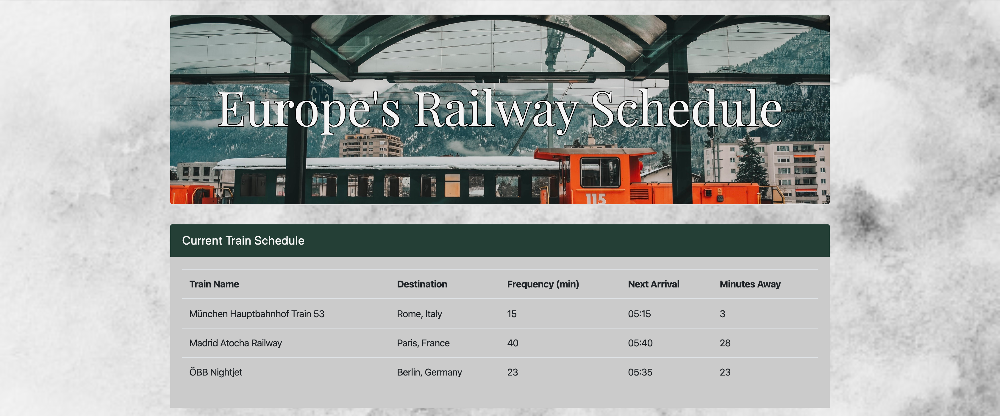
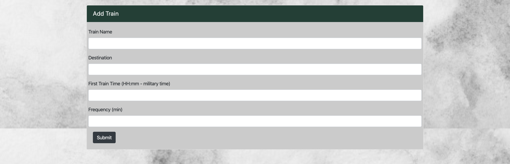

# Train-Scheduler

**Link to page: https://joditivis.github.io/Train-Scheduler/**

# About:
University of Denver Coding Bootcamp seventh week assignment: This assignment required us to create a Train Scheduler using Firebase database and API.

# How It Works:
- Make up your own European train
- Enter the destination you wish to travel to
- Make up a time for the first train of the day to arrive and how frequently you want the train to come to the station
- Once you enter all of these fields, it will then calculate how many minutes away the next train is based on the first trains arrival time and its frequency

# Tools + Languages Used:
* HTML
* CSS
* Bootstrap
* Google Fonts
* JavaScript
* Firebase real-time data-base
* Moment.js

# Features:

